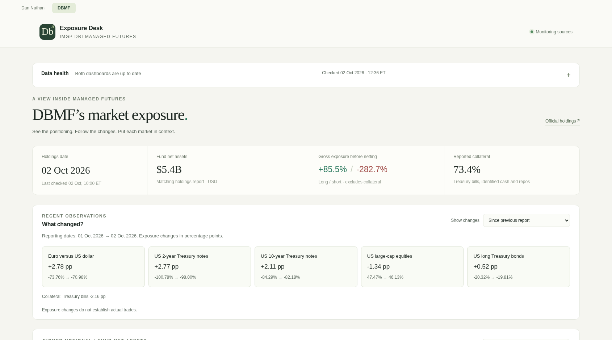

<div align="center">

# Research Desk

**Dan Nathan disclosures · DBMF market exposure**

See what changed, explore the charts, and check the original sources.<br>
Runs on your computer. No account, API key, or AI subscription required.

[Get started](#get-started) · [User guide](docs/guide.md) · [Technical reference](docs/reference.md) · [MIT license](LICENSE)

</div>



## What you can do

- **Follow Dan Nathan’s CNBC disclosures:** see additions, removals, price charts, and the original wording.
- **Explore DBMF:** compare reported market exposures, inspect historical holdings, and see what changed.
- **Keep your own history:** automatic collection, source archives, CSV downloads, and daily local backups.

Disclosures and exposures are observations, not verified trades or investment recommendations. History starts with your installation; optional DBMF imports add available historical reports, with gaps clearly marked.

## Get started

You only need **Docker** and an internet connection. Docker runs the app and its background collectors together; you do not need to install Python or Node.js.

### 1. Install and open Docker

Choose your system: [Windows](https://docs.docker.com/desktop/setup/install/windows-install/) · [Mac](https://docs.docker.com/desktop/setup/install/mac-install/) · [Linux](https://docs.docker.com/engine/install/).

On Windows or Mac, open **Docker Desktop** after installation and wait until it says Docker is running. On Windows, use its **Linux containers / WSL 2** setup. Linux users also need the [Docker Compose plugin](https://docs.docker.com/compose/install/linux/).

### 2. Download this project

At the top of this GitHub page, click **Code → Download ZIP**, then extract it into a folder you want to keep. Your collected data will live there too.

Open a terminal **inside the extracted folder** (the one containing `compose.yaml`): on Windows, right-click the folder’s background and choose **Open in Terminal**, using a **PowerShell** tab; on Mac, right-click the folder in Finder and choose **Services → New Terminal at Folder**; on Linux, choose **Open in Terminal**.

If that menu is missing, open PowerShell (Windows) or Terminal (Mac/Linux), type `cd `, drag the extracted folder into the window, and press Enter.

### 3. Start the app

Copy the commands for your system, paste them into that terminal, and press Enter. Run this setup once.

<details open>
<summary><strong>Windows — PowerShell</strong></summary>

```powershell
Copy-Item .env.example .env
New-Item -ItemType Directory -Force data
docker compose up -d --build --wait
```

</details>

<details>
<summary><strong>macOS / Linux — Terminal</strong></summary>

```bash
cp .env.example .env
printf 'APP_UID=%s\nAPP_GID=%s\n' "$(id -u)" "$(id -g)" >> .env
mkdir -p data
docker compose up -d --build --wait
```

If Linux reports a Docker socket permission error, prefix **Docker commands only** with `sudo`.

</details>

The first build can take several minutes. When it finishes, open **[localhost:8765](http://localhost:8765)** in your browser. Switch between **Dan Nathan** and **DBMF** at the top. Data may take a little longer to appear while the first collection finishes; check **Data health** for progress or source errors.

The app runs while your computer and Docker are running. You can close the terminal and browser. Collection pauses while the computer sleeps; reopen Docker Desktop after restarting your computer. It is accessible only on this computer by default; [remote access and configuration](docs/reference.md#open-the-dashboard) are covered separately.

## Everyday use

Run these commands from the same project folder:

| What you want to do | Command |
| :--- | :--- |
| Stop the app | `docker compose stop` |
| Start it again | `docker compose up -d --wait` |
| Check that all three services are healthy | `docker compose ps` |
| Add available DBMF historical reports | `docker compose exec -T dbmf-collector python -m tracker.cli dbmf-backfill` |
| Make a backup now | `docker compose exec -T collector python -m tracker.cli backup` |

Your history is in **`data/`**, and daily backups are in **`data/backups/`**. Keep this folder and your **`.env`** file when updating. Use the [verified export commands](docs/reference.md#off-device-backups) to copy a backup to an external drive or synced folder. [Update and recovery instructions →](docs/reference.md#updating)

## Need help?

| Problem | Try this |
| :--- | :--- |
| “Cannot connect to the Docker daemon” | Open Docker Desktop, wait for it to start, then repeat the Docker command. On Linux, start Docker and check access permissions. |
| “No configuration file provided” | Open the terminal in the extracted folder containing `compose.yaml`. |
| Port 8765 is already in use | Open `.env` in a text editor, change `APP_PORT=8765` to `APP_PORT=8766`, then run `docker compose up -d --wait` and visit `http://localhost:8766`. |
| Dashboard empty or a service unhealthy | Wait for the first collection, check **Data health**, and run `docker compose logs --tail=100`. Source failures retain previously saved data. |
| “Permission denied” for `/data` on Linux | Follow the macOS/Linux setup as your normal user; [check directory ownership](docs/reference.md#configure-your-installation). |

[User guide](docs/guide.md) covers charts, comparisons, alerts, and source evidence. [Technical reference](docs/reference.md) covers data methods, development, tests, and operation. For a reproducible bug, [open an issue](https://github.com/chrisduvillard/ResearchDesk/issues) with your operating system, steps, and relevant error message; remove personal details from logs.

---

**Python · FastAPI · SQLite · JavaScript · Docker Compose**

Original code and documentation: [MIT](LICENSE). Data and third-party libraries retain their own terms. Lightweight Charts™ by [TradingView](https://www.tradingview.com/) and Swagger UI are bundled locally with their Apache 2.0 licenses. This project is not affiliated with CNBC, Dan Nathan, iMGP, or TradingView.
