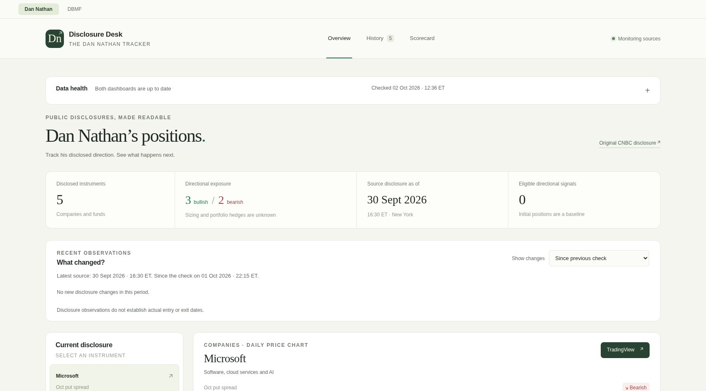

# Research Desk · User guide

[← Installation and overview](../README.md) · [Technical reference](reference.md)

## Expanded daily workflow

Open **Today** for the deterministic 07:00 Europe/Zurich briefing. The live column covers subsequent activity. Each item shows its source, public date, usable date, and evidence link. Corrections remain corrections. A missed morning cutoff is generated when the analytics worker resumes.

Use **Contributors** to inspect separately scoped disclosures for each person. Use **Calls** for owner-reviewed recommendations. Global search opens a security or futures-market page with prices, contributor evidence, fund holdings, and a dated activity list. Search uses source identities; matching ticker text alone never merges different securities. Owners can link verified identities with a source URL and recorded reason on the asset page.

**Funds** compares signed notional/NAV, equity weights, collateral, issuer risk weights, and volatility contribution in separate views. Select latest-available or an exact shared reporting date. Missing cells stay missing. A complete report can establish zero for an exited holding; an incomplete download cannot. Open a fund to inspect quantities, expiry, original rows, changes, and equity concentration. Contract rolls are identified separately. Sector allocation remains unavailable until dated, verified classifications exist. Holdings weight changes are never labeled as trade notifications.

The original **Dan’s desk** (`/dan`) and **DBMF detail** (`/dbmf`) remain available. Old root query/hash bookmarks redirect to Dan’s desk. Their legacy methods and detailed controls are documented below.

## Owner setup

Reading the private dashboard does not require an account. Editing calls, interpretations, source settings, benchmarks, alert rules, and model definitions requires the single owner password. There is no public registration.

From the installation folder, run this interactive command once:

```bash
docker compose exec web python -m tracker.cli owner-setup
```

Enter a password of at least 15 characters twice. It is not echoed or supplied as a command-line argument. Use **Owner login** in the dashboard. To replace a lost password, run `docker compose exec web python -m tracker.cli owner-reset`; this invalidates existing sessions. Logout also revokes the current session. Passwords use Argon2id; sessions expire after 12 hours. Five recent failed login attempts trigger throttling.

For local HTTP, the example `.env` sets `APP_SECURE_COOKIES=0`. For private HTTPS through a reverse proxy, set `APP_SECURE_COOKIES=1` and `APP_ORIGIN` to the exact HTTPS origin, with no trailing slash. Restart the services after changing these settings. Keep the host bind on loopback and use your existing private network. Do not expose the app publicly.

### Record and approve a call

1. Open **Calls → Record a call**, choose the contributor, and search for the instrument.
2. Supply direction/action, instrument type, spoken timestamp with UTC offset, matching IANA timezone, original source URL, a short excerpt, and stated horizon. Add conditions or a target only if actually stated.
3. Save the draft, inspect the displayed evidence, then choose **Approve this revision**.
4. Use **Edit** to create another draft revision, or **Retract** with a reason. Revision history remains available.

The usable timestamp is the later of the public timestamp and approval. Historical entry cannot backdate a live signal. Conditional, ambiguous, unverified, and actual option-contract recommendations remain visible but are excluded from automated portfolio entries. A contributor direction review records an interpretation correction; it does not fabricate a trade or retrospectively eligible signal.

## Expanded source coverage

| Source | Current integration | Qualification requirement |
| --- | --- | --- |
| Dan Nathan | Existing automatic disclosures and preserved history | Original archives retained |
| Karen Finerman, Guy Adami | Automatic dated official CNBC sections | Failures retain last accepted state |
| Josh Brown, Steve Weiss, Tim Seymour | Reviewed call entry; automatic disclosure coverage unavailable | A supported, dated official section must be qualified |
| DBMF | Original collector plus shared fund model | Existing detailed view retained; shared alerts require the scheduled gate |
| KMLM | Official page plus holdings CSV | Observation until five successful scheduled slots across two reporting dates |
| CTA | Official holdings workbook and separate issuer risk profile | Same scheduled gate |
| ARKK, ARKQ, ARKW, ARKG, ARKF, ARKX | Official public website endpoint and holdings CSV | Same scheduled gate for each fund |
| WTMF | Unavailable: official requests from the host returned HTTP 403 | Accessible unattended official source and qualification still required |

Live checks on October 2–3, 2026 found KMLM, CTA, and all six ARK holdings downloads accessible. This is evidence of access, not completion of the scheduled qualification gate. Source access can change; **Sources & alerts** shows current runs. No manual holdings import substitutes for blocked new fund automation. ARK trade notifications are not inferred from holdings; their integration and verified sector history remain unavailable.

Contributor schedules remain 22:15 America/New_York; fund schedules are 10:00 and 22:30 in that timezone. The operating system timezone does not change these schedules. New funds begin in observation mode; alerts stay suppressed until qualification. A source failure has bounded retries and does not stop the other sources.

## Scorecard methodology

**Follow / fade** separates contributor, evidence stream, asset class, and 1/5/20/60-session horizons. The headline default is 20 sessions. Entry is the first regular-session open after the information becomes usable. Disclosures use first accepted acquisition time; calls use the later public/approval timestamp. Initial baselines, interpretation corrections, unverified mappings, ambiguous directions, and overlapping same-direction observations do not inflate the headline sample. Inspect the saved signal rows for exclusions and missing prices.

The adjusted-price scorecard shows gross and modeled net returns, mean, median, win rate, count, missing data, follow/fade/always-long comparisons, and benchmark coverage. SPY is the initial benchmark for verified US equity listings. Other comparisons need an owner-configured benchmark. A price or benchmark gap remains explicit; unrelated classes are not ranked together.

Defaults are 5 basis points on each side, 5% annual short borrow using actual calendar days/365, and zero idle-cash return. These are editable scenarios. Descriptive 95% block-bootstrap intervals use a recorded deterministic seed and session blocks at least as long as the horizon, keeping same-day observations together. Intervals and rankings are suppressed below 30 eligible signals or three complete horizon blocks. Saved inputs include evidence and immutable price vintages, so later data corrections do not rewrite saved results.

## Hypothetical portfolio rules

Each definition models one contributor and one evidence type, with paired follow/fade runs. ETF holdings never generate simulated positions. Starting capital is $100,000; a new entry targets 10% of current equity, with at most ten positions and 100% gross exposure at entry. Fractional shares are allowed. Short proceeds and their initial capital requirement remain restricted. There is no pyramiding or daily rebalance.

Fixed-horizon models exit at the close of session 1, 5, 20, or 60 and ignore intervening signals for that instrument. Signal-driven models exit at the next usable open after an opposing signal, explicit close, or valid complete disclosure removal, with a 60-session maximum. A removal is an observed absence, not a verified sale. Reversals close first, then evaluate a new entry. Same-direction updates do not reset the holding clock.

Events use chronological availability and stable ID tie ordering. A skipped entry records its reason. Missing prices on an open position stop complete valuation; no stale substitute or invented delisting exit is used. Nonpositive equity stops the model. Split-adjusted quantities and explicit dividend cash flows, including short dividend debits, are accounted separately from scorecard adjusted prices. Options are not simulated from underlying moves.

Inspect equity, drawdown, exposure, turnover, trading costs, borrowing, trades, skips, and comparable gross buy-and-hold. Coverage matters even when idle capital has a zero return. **Exploratory historical** runs are labeled separately from **Prospective** definitions starting now. To change rules, enter the previous definition ID and save a new version; old definitions and runs remain unchanged. Later call corrections cannot erase an entry that was usable when a prospective model entered it.

Free price data, uncertain historical coverage, and unknown borrow availability limit realism. These results measure specified research rules, not actual contributor performance or achievable execution.

## Expanded alerts and troubleshooting

**Sources & alerts** supports global defaults and more specific source/watched-asset rules. Default alerts cover contributor additions/removals/direction changes, approved calls, futures moves of at least 5 percentage points, equity weight moves of at least 1 point, and direction flips where both sides exceed 1% in magnitude. Exhausted retries, overdue collection, and recovery also appear.

Notification permission belongs to each browser. Enabling starts at the current activity cursor, without replaying the archive. Web Locks and a transactional browser cursor coordinate tabs. Restoring a backup resets the cursor epoch; sessions are invalidated. Notifications work only with an open dashboard tab and browser support; the briefing remains readable without permission.

- A blank fund cell means missing data; inspect qualification and reporting dates before comparing.
- A queued simulation needs the **analytics** service; inspect `docker compose logs --tail=100 analytics`.
- A login that does not persist on local HTTP usually means secure cookies are enabled; use HTTPS or the explicit local-only setting above.
- A call that cannot be approved may have changed revision in another tab; reload and check the current draft.
- An unavailable source is not repaired by clearing history. Retain archives and inspect the source error.

## Legacy desk daily workflow


### 1. Start with “What changed?”

- **Dan Nathan:** see newly disclosed or removed instruments, direction and strategy updates, and audited interpretation corrections. Open a card to inspect the original evidence. “Since previous check” compares accepted observations; repeated or rejected downloads do not manufacture changes.
- **DBMF:** see the five largest net exposure changes, newly present or absent markets, and collateral changes. The comparison shows both actual reporting dates, even when they are months apart. These are changes in percentage points, not inferred transactions.
- **Since my last visit:** compare with the last view recorded by this browser. DBMF retains the exact previously viewed report, including its revision. Newly saved historical reports and revisions are counted separately from changes to the latest portfolio.

The visit baseline stays fixed while a tab is open. Refreshing or returning starts a new visit. A first visit falls back to the previous report comparison. Visit markers and preferences live in browser storage; they are specific to the browser and address used to access the app. Clearing site data resets them.

### 2. Select a market or instrument

Click a position to bring its chart into view. DBMF change cards also open the market detail; Dan Nathan change cards open the original evidence. DBMF’s market detail sits immediately below current positioning, with controls to return to positioning or open exposure history. Both chart range controls stay synchronized.

Selections survive refreshes and dashboard switches. URLs preserve the selected instrument or market, range, comparison date, evidence report and source revision. Dan Nathan URLs also preserve the active page, history/scorecard filters, horizon and exposure shading. Browser **Back** and **Forward** restore those views. Explicit bookmark parameters take precedence over remembered preferences.

For DBMF, a requested comparison date uses the latest accepted report **on or before** that date. The page displays the actual date prominently. It never invents a missing observation.

### 3. Check freshness

Expand **Data health** on either dashboard to inspect both collectors:

| Field | What it means |
| :--- | :--- |
| Source reporting date | The date the publisher assigns to its disclosure or holdings |
| Last successful source check | When the app last obtained an accepted source, including an unchanged report |
| Latest completed prices | The dates of cached daily bars, with details for each market |
| Last successful price refresh | When the price cache last refreshed successfully |
| Collector | Whether the independent worker is running and reporting a heartbeat |

A successful download does not make an old source current. Cached holdings and prices remain visible during failures.

**Optional browser alerts:** expand Data health and choose **Enable browser alerts**. The browser asks for notification permission. Alerts cover repeated failed/incomplete collections, stale data, missing worker heartbeats and unfamiliar DBMF instruments. They notify once per ongoing problem, plus recovery; repeated checks and other open tabs share the same incident state where browser locking is supported.

Alerts work while a dashboard tab is open and able to run, including in the background subject to browser throttling. They do not run after every tab is closed. Nothing is sent to an external messaging service. Unsupported or blocked notifications leave the in-app status panel available. Use **Disable browser alerts** to turn them off.

### 4. Inspect corrections

Expand **Source revisions** on DBMF. Choose a preserved revision to compare:

- reporting date, collection timestamps, matching net assets and source downloads;
- exact before/after contract values, quantities, identifiers, weights and exposure percentages;
- added or removed rows and the resulting market exposure changes;
- whether the source, processing rules, or both changed.

Comparisons require the **same reporting date and source type**. Daily holdings and consolidated historical schedules are not presented as corrections to one another. Acquisition timestamps establish revision order, including recovered imports. Rows use exact identities; ambiguous matches appear as removed and added. A source revision is not a trade signal.



## How the data works

### Sources and schedules

| Data | Source | Collection / coverage |
| :--- | :--- | :--- |
| Dan Nathan disclosures | [CNBC disclosures](https://www.cnbc.com/dan-nathan/) | Daily at **22:15 New York time** |
| Current DBMF holdings | [Official iMGP holdings table](https://www.imgp.com/us/fund/US53700T8273-imgp-dbi-managed-futures-strategy-etf/) | Daily at **10:00 and 22:30 New York time** |
| Historical DBMF holdings | Verified official consolidated reports | 18 reporting dates from December 2021 through June 2026 in the current catalog |
| Daily prices | Yahoo Finance through yfinance | Refreshed independently of successful holdings parsing; completed bars only |

Schedules follow New York daylight saving time. Each slot allows three attempts, with retries after 5 minutes and then another 30 minutes. Startup catches up with the latest due check. Collection does not invent reports for missed days.

Historical coverage is incomplete from DBMF’s May 2019 inception. Confirmed sources include [September 30, 2025](https://www.imgp.com/wp-content/uploads/imgp-us-q32025.pdf) and [March 31, 2026](https://www.imgp.com/wp-content/uploads/2026/06/Litman-Gregory-NPORT-F-3.31.26-19357A-bannerless.pdf). Seven additional SEC schedules were recovered in the [release source follow-up](data-follow-up-release.md); importing their older layouts and collateral accounting remains outstanding. Access results and coverage gaps remain visible. The catalog includes 18 verified historical reports. Three additional futures references cover former markets, and excluded candles include inspectable provider evidence. See the [source and historical coverage reference](reference.md#dbmf-collection-and-historical-coverage) and [data availability follow-up](review-2026-10-02.md#data-availability-follow-up--version-150).

### DBMF arithmetic

```text
Exposure (%) = signed current notional value / matching fund net assets × 100
Gross exposure = long exposure + absolute short exposure, before netting
```

Dollar amounts remain decimal strings; calculations use 50-digit decimal precision. Rounded source weights are validation checks. Expirations aggregate into their underlying market, while Treasury maturities and ultra contracts remain separate. Treasury bills, identified cash and repurchase agreements appear under Collateral.

Exposures can exceed 100% and do not measure risk contribution. Bond direction refers to prices; currency direction refers to the named currency against the dollar. Historical calculations use current **Notional Value**, not original contract values, accounting gains/losses or volatility-adjusted allocations. Consolidated schedules prevent counting subsidiary holdings twice.

| Exposure | Price reference |
| :--- | :--- |
| US 2-year / 10-year / long Treasury bonds | `ZT=F` / `ZN=F` / `ZB=F` futures |
| US large-cap equities | `ES=F` futures |
| Gold / WTI crude oil | `GC=F` / `CL=F` futures |
| Euro versus US dollar | `EURUSD=X` |
| Japanese yen versus US dollar | `JPY=X`, inverted to USD per yen |
| Developed equities outside North America | `EFA` ETF proxy |
| Emerging-market equities | `EEM` ETF proxy |

Futures references can use different expirations and contain roll-related changes. DBMF reference prices are unadjusted; ETF distributions are not reinvested. Negative futures prices are supported. Markets without a verified reference retain their exposure history without a price chart.

Equity completion respects exchange holidays and early closes. Futures wait until 18:00 New York on their trade date; currencies wait until 01:00 UTC after the provider date. Freshness warnings allow scheduled collection/retries before expecting a new equity bar; futures and currency caches warn after four calendar days without a bar. [Full price rules](reference.md#dbmf-price-references).

### Safe handling of source changes

Parsing, instrument naming, aggregation, summaries and strategy calculations use deterministic code. **There are no LLM calls, model credentials or model costs.**

Complete raw responses are archived, including rejected sources. The parser tolerates known heading aliases, reordered columns and routine contract-name/expiry variations. Missing totals, inconsistent arithmetic, ambiguous columns and unfamiliar instruments prevent publication. The last accepted snapshot remains current.

A new market appears under **Holdings needing review**. An operator verifies its identity and value basis, adds a sourced mapping through the CLI, and replays the original archived report. Mappings are audited and loaded without restarting services. A new security type with different exposure arithmetic requires a reviewed adapter. [New-instrument workflow and examples](reference.md#new-instruments-and-source-changes).

### Dan Nathan interpretation and scoring

Initial holdings form a baseline. Later valid observations distinguish additions, removals, direction changes and strategy updates. Unknown or ambiguous structures stay explicit; a month alone never establishes an option expiry day or year.

The scorecard enters an eligible directional episode at the first regular market open strictly after observation and measures 1, 5, 20 and 60 trading sessions. It compares follow, oppose and always-long underlying returns. Baselines, ambiguous exposures, complex structures and retrospective corrections are excluded. It is not actual options P&L or a portfolio simulation. [Methodology](reference.md#scorecard) · [Options analysis](reference.md#strategy-analysis-and-payoff-explorer) · [TradingView setup](reference.md#tradingview).

## API

Interactive documentation: **`/docs`**, served entirely from local assets. JSON data endpoints return `Cache-Control: no-store`.

| Area | Routes |
| :--- | :--- |
| Shared health | `GET /api/desk/health` |
| Disclosure summaries | `GET /api/changes?after_id=…` |
| Disclosures | `/api/status`, `/api/positions`, `/api/instruments`, `/api/events`, `/api/timeline/{symbol}` |
| Charts and analysis | `/api/prices/{symbol}`, `/api/scorecard`, `/api/analysis/{symbol}` |
| Hypothetical calculator | `POST /api/payoff` — calculation only |
| DBMF | `/api/dbmf/status`, `/exposures`, `/history`, `/prices/{market_id}` |
| DBMF summaries | `/api/dbmf/changes?baseline_id=…&since_id=…` |
| DBMF corrections | `/api/dbmf/revisions`, `/revisions/{id}?against_id=…` |
| Evidence | `/api/snapshots/{id}` and `/source`; `/api/dbmf/reports/{id}` and `/source` |
| Review audit | `/api/dbmf/unmapped`, `/api/dbmf/mappings` |
| Downloads | `/api/export/history.csv`, `/api/export/pine/{symbol}`, `/api/dbmf/export/history.csv` |

Routes abbreviated in the DBMF rows share the `/api/dbmf` prefix. Revision listing supports `limit` and `before_id` pagination. Exposure history CSV includes all accepted revisions at full precision. The dashboard shows the canonical accepted observation for each date.

## Troubleshooting

| Symptom | Check |
| :--- | :--- |
| Dashboard cannot connect | Check `docker compose ps`, your configured port, and the SSH tunnel when accessing a remote server. |
| Data directory missing or permission denied | Create `HOST_DATA_DIR` and check that its owner matches `APP_UID`/`APP_GID`. |
| Successful fetch but old holdings date | The issuer may still publish the previous report. Compare source date and collection time separately. |
| Unknown DBMF contract | Open Holdings needing review; follow the sourced mapping workflow before replaying. |
| Price chart unavailable | Inspect per-market freshness. A provider failure preserves the cache; a new market may have no verified reference. |
| Comparison uses an earlier date | No accepted report exists on the requested date. The actual earlier date is displayed. |
| No browser notification | Enable alerts in Data health, allow notifications in browser settings, and keep a tab open. Mobile/browser support varies. |
| Saved view looks different on another device | Preferences and visit markers are browser-local. Use the bookmarked URL to transfer a view. |
| No source revisions listed | No accepted version of that reporting date/source has changed. Repeated downloads are deduplicated. |
