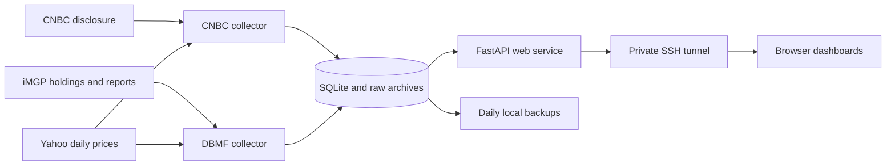

# Research Desk · Detailed reference

[← Installation and overview](../README.md) · [User guide](guide.md)

This reference covers source interpretation, price rules, historical data, and operator workflows. The [user guide](guide.md#daily-workflow) explains change summaries, saved views, shared health, browser alerts and source revision comparisons.

A self-hosted record of Dan Nathan's CNBC disclosures, with daily charts, a prospective directional scorecard, and a TradingView Pine indicator. All services and data live on the machine where you install the app.

## Open the dashboard

Follow the [quick start](../README.md#get-started) to install the app and configure your data directory. For a local installation, open **http://localhost:8765**. For a remote installation, replace `user@your-server` with your SSH destination and run this on your workstation:

```bash
ssh -N -L 8765:127.0.0.1:8765 user@your-server
```

Keep the tunnel open and visit **http://localhost:8765**. Closing the tunnel only closes browser access; the server continues collecting data. The site is bound to localhost on its host. Adjust the destination port if you set a different `APP_PORT` in `.env`.

Use the **Dan Nathan / DBMF** switch at the top. DBMF is also available directly at **http://localhost:8765/dbmf**.

## DBMF exposure dashboard

DBMF shows signed notional exposures from the [complete official holdings table](https://www.imgp.com/us/fund/US53700T8273-imgp-dbi-managed-futures-strategy-etf/). Exposure is **signed notional value / matching total fund net assets × 100**. Exact dollars are retained as decimal strings; percentages use 50-digit decimal arithmetic, with rounding only in the display. The live “Weight” column is a rounded fraction (−1.01 means roughly −101%), used as a validation check. The live “Market Value” column supplies signed futures notional and collateral fair value.

- Expirations of the same market are aggregated. Long, short and gross values are calculated before netting opposing contracts. Treasury maturities and older ultra Treasury contracts remain distinct.
- Treasury bills, separately identified cash and repurchase agreements appear under **Collateral**. Other assets less liabilities are never assumed to be cash.
- Exposures can exceed 100% and do not measure risk contribution. Bond direction describes bond prices; currency direction describes the named currency against the dollar. Exposure changes do not establish actual trades.
- Compare with the previous report, a week, a calendar month, or a chosen date. The latest report on or before the requested date is used and its actual date is displayed. No earlier report means comparison values are unavailable.
- Select a heatmap cell to compare that report and inspect its market. Price and exposure panels share their time axis. The 1M, 3M, 6M, 1Y and All controls apply to both heatmap and charts. Exposure marks appear only on reporting dates; no intervening positions are inferred. The report selector and expandable evidence provide keyboard access to every observation and original contract row.
- Full precision and all accepted revisions are available in the CSV download. Archived sources are downloadable from the evidence section. Native TradingView exposure integration and estimated portfolio returns are outside this version.

### DBMF price references

| Market | Reference | Type |
| --- | --- | --- |
| US 2-year Treasury notes | `ZT=F` | Futures reference |
| US 10-year Treasury notes | `ZN=F` | Futures reference |
| US long Treasury bonds | `ZB=F` | Futures reference |
| US ultra 10-year Treasury notes | `TN=F` | Futures reference |
| US ultra-long Treasury bonds | `UB=F` | Futures reference |
| US federal funds futures | `ZQ=F` | 30-day federal funds futures reference |
| US large-cap equities | `ES=F` | S&P 500 futures reference |
| Gold | `GC=F` | Futures reference |
| WTI crude oil | `CL=F` | Futures reference |
| Euro versus US dollar | `EURUSD=X` | Currency reference |
| Japanese yen versus US dollar | `JPY=X`, inverted | USD per yen; high and low invert in reverse order |
| Developed equities outside North America | `EFA` | iShares MSCI EAFE ETF proxy |
| Emerging-market equities | `EEM` | iShares MSCI Emerging Markets ETF proxy |

References use unadjusted Yahoo Finance daily bars from fund inception where available. ETF distributions are not reinvested. Futures may use different expirations from DBMF and contain roll-related price changes. Negative futures prices are supported. Eurodollar and SOFR exposure history remains available without a price chart. As checked on 2 October 2026, Yahoo returned no history for the discontinued Eurodollar symbol and only a current quote for SOFR. Federal funds and the two ultra Treasury references have completed daily history from May 2019. Rising short-term rate futures prices correspond to lower implied interest rates.

ETF bars are published after their exchange session closes, respecting holidays and early closes. The listed CME futures wait until 18:00 New York on their trade date. Currency bars wait until 01:00 UTC after their provider date. Unfinished bars never enter the cache. Inconsistent OHLC bars are omitted and listed in the API and page; missing values are never replaced with invented prices. Expand **Inspect excluded price bars** to see the original provider values, dates and validation failures. Values in this evidence are saved before currency inversion; nonfinite values are retained as text. A rejected candle does not establish which individual quote is wrong. A new successful refresh records this evidence; older cached exclusions can display “Not saved” until refreshed. Duplicate dates reject the refresh even when one duplicate is invalid. Failed or truncated refreshes retain the last cache.

### DBMF collection and historical coverage

The independent `dbmf-collector` service checks **10:00 and 22:30 America/New_York daily**. Each scheduled slot allows three attempts (retry after 5 minutes, then another 30). Startup checks the latest missed slot without inventing missed reports. An OS lock prevents overlapping DBMF runs. CNBC collection remains on its own service and schedule.

Raw source responses are content-addressed compressed archives in `dbmf/raw/`, including rejected documents. Collection runs retain fetch times and links to the raw download, even when the parsed report repeats. Identical reports and row reordering create no extra observation. Changed reports for an existing date create immutable revisions. Dashboard chronology uses reporting dates, so an old import cannot displace newer holdings; a live report takes priority over a historical import for the same date.

The parser checks fund identity, dates, the closed holdings table, required column meanings, every row and its rounded weight. It tolerates reordered columns, changed HTML classes/IDs, known heading aliases, harmless added columns and explicit percentage weights. Validation uses the precision actually published in the weight column. Ambiguous financial columns, duplicate candidate tables, non-USD values, malformed rows and missing totals reject publication. Absence becomes zero only in an accepted complete replacement. A silently omitted but structurally valid row cannot be independently detected from a live source without a notional control total. Last valid data and the collection error remain visible.

Historical backfill covers **18 official reports**: December 2021; all four quarters of 2022, 2023 and 2024; March, September and December 2025; March and June 2026. Only consolidated DBMF schedules are imported. The current **Notional Value** is used, reconciled against original amounts and accounting gains/losses as checks. Those original amounts and gains/losses never become exposure. Treasury bill values, repos, securities totals and matching net assets are also reconciled. Subsidiary investments are not counted twice.

The catalog includes the confirmed [September 2025](https://www.imgp.com/wp-content/uploads/imgp-us-q32025.pdf) and [March 2026](https://www.imgp.com/wp-content/uploads/2026/06/Litman-Gregory-NPORT-F-3.31.26-19357A-bannerless.pdf) reports. Older issuer links were recovered on its current domain. The latest annual and semiannual statements follow the public document viewer linked from the issuer's resources page. Imports reject a catalog/date mismatch if a mutable URL changes to a new period.

Coverage is incomplete from the May 2019 inception. Identified 2019 and 2020 SEC filings returned HTTP 403 during initial verification; the status panel records access results for your installation. The September 2023 and June 2024 consolidated schedules were recovered on 2 October 2026. June 2025 and pre-December 2021 observations remain unimported. The [release source follow-up](data-follow-up-release.md) recovered seven full SEC schedules, including June 2025 and six older dates. They require a dedicated historical HTML adapter and reviewed collateral treatment before import; the earlier access failures are no longer the only barrier. See the [data follow-up](review-2026-10-02.md#data-availability-follow-up--version-150) for sources, independent price checks and remaining limits. Gaps remain visible. Backfill is an explicit operational import:

```bash
docker compose exec -T dbmf-collector python -m tracker.cli dbmf-backfill
docker compose exec -T dbmf-collector python -m tracker.cli dbmf-collect
docker compose logs --tail=100 dbmf-collector
```

Backfill skips previously accepted catalog sources. `dbmf-backfill --force` downloads them again to check revisions. New historical document layouts require a reviewed parser update. Instrument aliases and additional markets can be registered using the workflow below. Parsing, aggregation, naming and collection make no LLM calls.

DBMF's read-only routes are `/api/dbmf/status`, `/exposures`, `/history`, `/prices/{market_id}`, `/reports`, `/reports/{id}`, `/reports/{id}/source`, `/unmapped`, `/mappings` and `/export/history.csv`, all under `/api/dbmf`. History/prices accept ISO `start` and `end` dates. Exposures accept `compare=previous|week|month|date`, `compare_date=YYYY-MM-DD`, or an accepted `report_id`. Report lists include rejected sources and revisions, with `limit` and `before_id` pagination.

### New instruments and source changes

Recognized contracts tolerate routine case, spacing, punctuation and expiry changes. Treasury maturities, ultra contracts, currencies and contract sizes remain distinct. Matching uses explicit aliases; it never guesses from a similar name or an unverified ticker.

If a complete report contains unfamiliar names, **Holdings needing review** lists every unknown instrument, its reporting date, reported dollar value and archived source. The report stays unpublished until the instrument and the meaning of its value field are verified. These review values are labeled **Value / net assets**, because an unknown instrument's market value is not automatically its notional exposure. Invalid or incomplete reports cannot be approved just by adding a name.

Reviewed aliases and new market definitions live in SQLite and are included in backups. They take effect without rebuilding the image or restarting the services. To inspect the queue:

```bash
docker compose exec -T dbmf-collector python -m tracker.cli dbmf-unmapped
```

Create a JSON file in the `dbmf/` subdirectory of your configured `HOST_DATA_DIR` (`./data/dbmf/` by default), using the actual issuer name, a source URL supporting the mapping, and the review reason. Inside containers this is `/data/dbmf/`. For a new spelling of an **existing** market, use this structure (replace the placeholder text):

```json
{
  "market_id": "gold",
  "aliases": ["EXACT NEW GOLD CONTRACT NAME"],
  "source_url": "https://www.imgp.com/REPLACE-WITH-SOURCE",
  "reason": "Explain how the source establishes that this is the same Gold exposure."
}
```

For a **new** market, replace `market_id` with a complete `market` object. Example structure only; Silver has not been added to the production portfolio:

```json
{
  "market": {
    "id": "silver",
    "name": "Silver",
    "category": "Commodities",
    "value_basis": "signed_notional"
  },
  "aliases": ["EXACT SILVER CONTRACT NAME"],
  "source_url": "https://www.imgp.com/REPLACE-WITH-SOURCE",
  "reason": "Record evidence for the contract identity and signed notional value."
}
```

Non-collateral markets require `value_basis: signed_notional`; collateral requires `market_value`. Supported categories are Bonds, Equities, Commodities, Currencies, Short-term rates and Collateral. Aliases are literal names, with trailing three-letter month/two- or four-digit year expiries normalized automatically. Wildcards and conflicting assignments are rejected. Repeating an identical import makes no new mapping change.

A new market can be published without a price chart. To include a verified reference, add `provider_symbol`, `price_reference`, `price_kind` (`futures`, `currency` or `ETF proxy`) and optional boolean `invert` to its market object. The current completion rules support CME futures, major currency daily bars and US-listed ETF proxies. Confirm those rules fit the chosen reference. Existing market identities and price references cannot be silently replaced through this additive import.

```bash
docker compose exec -T dbmf-collector python -m tracker.cli dbmf-map --file /data/dbmf/new-market.json
docker compose exec -T dbmf-collector python -m tracker.cli dbmf-replay
```

The import records its source, reason and catalog version, then reprocesses pending archived reports. The worker also checks for parser/catalog changes every 30 seconds and processes up to 20 pending reports per pass. Each version gets one automatic attempt per rejected source; `dbmf-replay --force` explicitly retries unresolved reports. A busy live collection delays recovery until the next worker pass.

Recovery verifies archive checksums and reruns all original validation, including historical catalog dates. Original fetch dates and rejection records remain intact. Recovered reports link to their originals and record the processing time. A recovered older revision cannot replace a more recently fetched valid report for the same reporting date. Failed recovery never creates an endless retry chain. `/api/dbmf/mappings` exposes the mapping audit and `/api/dbmf/status` includes recovery and review status.

After adding a price reference, the next scheduled collection fetches its bars; `dbmf-collect` can refresh immediately. A new security type whose reported value is an accounting value rather than signed notional needs a reviewed calculation adapter before publication. Source-layout changes that remove totals or make columns ambiguous also need a parser update.

## Reading the tracker

Company and fund names are used throughout. Original tickers and wording remain available in evidence and exported data.

- **Baseline:** already disclosed when tracking began; actual entry date unknown.
- **Newly disclosed:** present now and absent from the previous valid snapshot.
- **Direction changed:** the direction of the disclosed exposure changed.
- **Strategy updated:** wording or expiry changed while the direction stayed the same.
- **No longer disclosed:** no longer listed by CNBC; actual closing date unknown.
- **Interpretation corrected:** an audited correction, excluded from the prospective scorecard.

Purchased call/put spreads use conventional vertical-spread interpretations and are marked inferred. The strategy library recognizes covered calls, protective puts, collars, straddles, strangles, butterflies, condors, calendars, diagonals, ratios, backspreads, risk reversals and synthetic stock. It reports conventional structures, assumptions and missing details. Ambiguous orientations remain conditional or unknown. Multiple opposing exposures appear as mixed. Position sizes and portfolio hedges are unknown. Missing or expired option months never manufacture a closing event. A disclosed month alone does not establish an expiry day or year.

Chart dates are first-observed dates in New York, shifted to the next market session for weekends and holidays. Charts display completed daily bars only. An observation recorded during an unfinished session will get its marker once that bar is available. A position may be a hedge; the tool describes exposure rather than inferring his motives.

## Strategy analysis and payoff explorer

Below the selected instrument's price chart, expand **Advanced options analysis** to access the optional tools. This section starts collapsed on each page load; expanding it reveals **Strategy analysis**, which shows the recognized structure, component legs, assumptions, missing facts, qualitative effects of volatility/time, and scorecard eligibility. Direction labels include **benefits from large moves**, **benefits from a price range**, and **conditional exposure**. These describe structure or expiration payoff, not current delta or Dan's overall portfolio.

A numerical payoff appears automatically when the wording establishes strikes, relative quantities and a shared expiration structure. Standard named strategies are modeled per normalized unit: conventional leg ratios and 100-share option multipliers are explicitly assumed. Actual holding size is unknown. An exact expiration day/year is never invented; a named vertical's theoretical common-expiration shape can still be shown without assigning it a calendar date.

**Explore a hypothetical payoff** opens an editable calculator:

1. Choose a standard example or enter up to 16 stock/call/put legs.
2. Enter bought/sold quantities, strikes, dates if known, and contract multipliers. Stock quantities are shares.
3. Confirm a shared expiration if dates are omitted. Different stated dates are rejected even if the checkbox is selected.
4. Optionally enter the **total** entry cost in USD for the entered strategy unit, including shares and option premiums: positive for a debit, negative for a credit.
5. Calculate, then move the price slider. The graph shows regions where higher prices help or hurt, extrema including unlimited tails, and breakevens when cost is known.

Leaving entry cost blank shows terminal value only. A blank cost is never treated as zero. Breakevens can be isolated prices or entire zero-profit intervals. Chart range limits never hide unlimited exposure in the calculated extrema. Example prices are hypothetical and independent of current quotations. Scenarios never write disclosures, events, reviews or scores.

All calculations use a shared-expiration payoff and omit early exercise, interim cash flows, dividends, fees and financing. Calendars/diagonals are recognized but require a separate valuation model and market inputs for numerical analysis; Greeks are not calculated in this version. Multiple separately disclosed positions are not combined into a net numerical exposure without known relative sizing.

The interpreter and calculator use ordinary Python rules and arithmetic. There are no LLM calls, credentials or LLM costs.

### Supported source notation

Named structures accept month/year or an exact ISO expiration, and slash-separated strikes, for example:

~~~text
MSFT Oct 500/520 call spread
MSFT Oct 450/475/525/550 credit iron condor
MSFT Oct 480/500/520 call butterfly
MSFT Oct 500 straddle for $20 debit
~~~

Strike ladders use the conventional named structure and matched quantities. Bare iron-condor/butterfly names require a clear credit/debit orientation or individual legs; bare ratio spreads, backspreads and risk reversals do not establish which legs were bought.

Explicit legs use a bracketed, semicolon-separated grammar, for example:

~~~text
Dan Nathan is long MSFT options [long 1 2026-10-16 500 call @ 20; short 2 2026-10-16 520 calls @ 10], and TLT.
~~~

The @ premiums are per option share (or the stock entry price for a stock leg). Total cost is calculated only if every leg's cost is supplied. Explicit options sharing only a month do not establish the same day. Unrecognized or incomplete list clauses retain the existing protection against false removals.

Definitions reference the [Options Industry Council strategy library](https://www.optionseducation.org/strategies/all-strategies-en). Source wording and the interpreter version remain attached to observations.

## Collection and data

The collector checks CNBC **daily at 22:15 America/New_York**, automatically following daylight-saving changes. It retries failed or partial runs after 5 minutes and then another 30 minutes, at most three scheduled attempts. On startup it catches up if the latest daily collection is missing. Catch-up observations are dated when fetched; intervening history is never invented.

Every fetched page is archived as compressed HTML, including rejected pages for diagnosis. Parsed snapshots, observations and source timestamps are separate records. Failed, incomplete, future-dated or older cached disclosures never erase the last valid positions. Reordering or repeating a disclosure does not create position events. Every nonempty paragraph after the disclosure header in its source body must be recognized; unfamiliar continuation wording rejects the snapshot and preserves current positions.

Prices come from Yahoo Finance through yfinance, with split/dividend adjustment. The complete cached interval is refreshed to maintain consistent adjustments. Errors or truncated responses preserve cached prices. The dashboard refreshes its status every minute. Initial chart backfill is about two years; disclosure history starts with the first actual observation. Personal research use only.

## Scorecard

A new unambiguous directional episode enters at the first regular US market open strictly after observation. Entry day is day one; horizons end at the 1st, 5th, 20th and 60th trading-session closes. Holidays and shortened sessions use the exchange calendar.

For each horizon: `underlying return = adjusted ending close / adjusted entry open - 1`. Follow multiplies this by +1 for bullish or -1 for bearish. Oppose reverses the sign. Always-long uses the underlying return over the identical dates.

Results show sample counts, win rates, mean and median returns. Baselines, unknown/mixed exposures, unverified instruments and retrospective corrections are excluded. Rolls with unchanged direction add no signal. Complex structures are excluded even when their conventional expiration exposure is bullish or bearish; the directional scorecard covers shares, single options, conventional verticals and synthetic stock. Incomplete horizons are pending; missing prices are never zero returns. Signals can overlap and results are equal-weight observations, not a portfolio simulation. Fees, borrow costs and financing are excluded. Actual options P&L requires undisclosed strikes, premiums, quantities and executions.

## TradingView

Use your own TradingView chart layout and install the indicator with the steps below.

1. Select a company/fund in the dashboard and click **TradingView**.
2. Download the Pine script, paste it into a **new** Pine Editor script, save it privately, and add it to a **1-day** chart.
3. In the dashboard, **Copy export**. In the indicator settings, paste it into the multiline input.
4. Paste a new export whenever you want to refresh TradingView. The dashboard and archive update automatically; Pine cannot pull this private API itself.

Version 1.1 exports use DN2; the updated indicator also accepts older DN1 exports. Existing installations need the updated script once to understand the richer direction labels. The indicator validates the symbol and daily timeframe, uses full company/fund names, and distinguishes baseline, additions, changes, removals and corrections. It shows source/export timestamps and optional exposure shading. Each export is limited to 400 events and 40,960 characters. The header states the included count and earliest date; CSV and dashboard retain the full history.

If a newly discovered instrument has no verified TradingView mapping, export is disabled until that mapping is supplied. The original five mappings are verified, including `CBOE:DRAM` for Roundhill Memory ETF.

The Pine symbol check also accepts TradingView’s Cboe One (`BATS`) feed for the same verified US-listed ticker. Exports for a different company or fund are rejected.

## Operations

Run these commands from your clone’s directory on the app’s host. Prefix Docker commands with `sudo` if your installation requires it.

Persistent data is configured by `HOST_DATA_DIR` in your local `.env`, defaulting to `./data`. Containers access that directory as `/data`. See the [configuration reference](#configure-your-installation) for ports, timezone and user/group IDs.

```bash
docker compose ps
docker compose logs --tail=100 collector
docker compose exec collector python -m tracker.cli collect
docker compose exec collector python -m tracker.cli backup
```

Back up the data and preserve your local `.env` before upgrading. Run `git pull --ff-only`, then `docker compose up -d --build --wait`. All three services have health checks and restart automatically. The Docker daemon must be enabled at boot. The database uses WAL transactions; an OS file lock prevents overlapping collection jobs. Containers use the configured `APP_UID`/`APP_GID`, with a read-only application filesystem and a persistent writable data mount. Logs rotate.

### Updating

For an installation downloaded as a ZIP:

1. In your existing project folder, run `docker compose exec -T collector python -m tracker.cli backup`. Copy the resulting archive from `data/backups/` to another location.
2. Run `docker compose down` to stop and remove the old containers. This preserves your data directory.
3. Download and extract the new project ZIP into a new folder.
4. Copy your **`.env`** file and the entire **`data/`** directory into the new folder. On a Mac, press **Command–Shift–.** in Finder to show hidden files. Copy your actual `.env`, not `.env.example`. If you configured an external `HOST_DATA_DIR`, keep that same path instead. Preserve directory ownership on Linux.
5. Open a terminal in the new folder and run `docker compose up -d --build --wait`. **Do not repeat first-time setup**, which would replace your configuration.
6. Open the dashboard and confirm your saved history and both collectors in **Data health**. Keep the old folder and backup until you have verified the update.

For a Git clone, back up first, then run `git pull --ff-only` and `docker compose up -d --build --wait` in the existing folder. Keep your `.env` and data directory. If you made local code changes, resolve them before updating.

### Reviewed interpretations and names

To record a correction for an instrument with a single current strategy:

```bash
docker compose exec collector python -m tracker.cli review MSFT unknown --reason 'Additional context makes the disclosed structure ambiguous'
```

This appends a review and correction event without editing the raw snapshot. The override follows only identical strategy wording; it does not apply to a new expiry or structure. Reviewed wording is excluded from prospective scores. Multiple strategies require individual analysis and are not silently overridden together.

To correct a display name or supply a TradingView mapping:

```bash
docker compose exec collector python -m tracker.cli instrument MSFT --name 'Microsoft' --tradingview NASDAQ:MSFT --reason 'Verified against the issuer and TradingView listing'
```

Name and mapping changes are audited and create no position events.

### Sourced option details

For a current position whose strikes or costs were disclosed elsewhere, record that source instead of modifying the original CNBC evidence. Put a model JSON file in the data directory (mounted as /data):

~~~json
{
  "same_expiry": true,
  "legs": [
    {"kind": "call", "quantity": 1, "strike": 500, "expiry": "2026-10-16", "multiplier": 100},
    {"kind": "call", "quantity": -2, "strike": 520, "expiry": "2026-10-16", "multiplier": 100}
  ],
  "net_cost": null
}
~~~

Then, on the app’s host:

~~~bash
docker compose exec collector python -m tracker.cli details MSFT --file /data/details.json --source 'URL or transcript reference' --reason 'Option legs confirmed in the cited source'
~~~

This appends an audited interpretation correction, preserves the original snapshot, and applies only to the identical strategy signature. A new expiry/wording does not inherit it. If several strategies are disclosed for one company, provide --signature using /api/analysis/{symbol}. Reviewed wording is excluded from prospective scores, including earlier signals using that wording. This command accepts complete legs suitable for a common-expiration payoff; use a qualitative review when the structure still needs a valuation model.

### Off-device backups

Connect an external drive, or choose a folder already synced by your cloud-storage app. Create a backup folder there first. With Research Desk running, run the matching command from the project folder, replacing the example path with your destination:

**Windows (PowerShell):**

```powershell
powershell -NoProfile -ExecutionPolicy Bypass -File .\scripts\backup.ps1 -Destination "E:\ResearchDeskBackups"
```

This execution-policy setting applies only to this script invocation.

**macOS / Linux:**

```bash
bash scripts/backup.sh "/Volumes/MyDrive/ResearchDeskBackups"
```

On Linux, use your actual mounted path, for example `/media/your-name/MyDrive/ResearchDeskBackups`. If Docker requires elevated access, use `sudo bash scripts/backup.sh "..."`.

The script creates a fresh consistent backup, copies it, compares SHA-256 checksums, and writes a `.sha256` file alongside it. Each export has a unique filename, so earlier copies are preserved. It refuses a missing destination; connect your drive first. Wait for your cloud app to finish syncing or safely eject your drive before disconnecting it. Exports are manual; daily automatic backups still stay under `data/backups/`. No external account or backup schedule is configured by these scripts.

### Backups and recovery

`backups/YYYY-MM-DD.tar.gz` inside `HOST_DATA_DIR` contains a consistent SQLite backup plus raw snapshots, DBMF source archives and current exports. The latest 30 daily archives are retained; the live snapshot archive is not pruned. Backups reside on the same host as the app.

To validate a backup without changing your running data:

1. In the project folder, create a folder named `restore-inbox` using your file browser.
2. Copy the backup you want to restore into it and name the copy `recovery.tar.gz`.
3. Run the command below. PowerShell, macOS Terminal, and Linux shells all accept it:

```text
docker run --rm --network none --user 0:0 -v "$PWD/restore-inbox:/restore-inbox:ro" dan-nathan-tracker:1.5.1 python scripts/check-backup.py /restore-inbox/recovery.tar.gz
```

Continue only when it prints **Backup verified**. This disposable container has no network access and only mounts the backup folder read-only. The checker uses an isolated temporary directory to validate SQLite, foreign keys, and every referenced source file’s hash. It rejects unsafe paths and does not change the live database. No SQLite or Python installation is required on your computer.

To restore the verified backup with the default `HOST_DATA_DIR=./data`:

1. Run `docker compose down` and wait for all three services to stop.
2. In your file browser, rename the current `data` folder to a unique name such as `data-before-restore-2026-10-02`. Keep it until you have checked the restored app. Create a new, empty `data` folder.
3. Extract the verified archive with the following command (Windows includes `tar`; it is also included on macOS and most Linux systems):

```text
tar -xzf restore-inbox/recovery.tar.gz -C data
```

4. On macOS/Linux, make sure the restored files belong to your current user, matching the setup IDs in `.env`:

```bash
sudo chown -R "$(id -u):$(id -g)" data
```

5. Run `docker compose up -d --wait`, open the dashboard, and check that the saved history appears and both collectors are healthy. Keep the preserved old folder and original backup until you are satisfied.

If `HOST_DATA_DIR` points somewhere else, perform the rename, extraction, and ownership steps at that configured location instead of `./data`. Never extract over the live database or a nonempty destination. A backup does not contain your `.env`, so keep that file separately.

### Tests

```bash
uv venv --python 3.12
uv pip sync requirements.lock
npm ci --ignore-scripts
npm run vendor
npm test
.venv/bin/python -m pytest -q
```

Tests use temporary databases and archived-page fixtures. They cover current disclosure interpretation, uncertain strategies, inherited sides, duplicates, stale/incomplete pages, removals, rolls, re-entries, audited corrections, calendar timing, score arithmetic, missing prices, corporate-action refresh, export limits, APIs, scheduler catch-up and backup restoration.

## Interfaces and storage

Read-only application routes (including /api/analysis/{symbol} and the calculation-only POST /api/payoff): `/api/status`, `/api/positions`, `/api/instruments`, `/api/events`, `/api/timeline/{symbol}`, `/api/prices/{symbol}`, `/api/scorecard`, `/api/snapshots/{id}`, `/api/export/pine/{symbol}`, `/api/export/history.csv`. Interactive API reference: `/docs`. Operational writes use the CLI.

DBMF retains repeated source acquisitions separately from immutable report revisions, so recovering an older rejected report cannot supersede a later observed copy. On upgrade, verified legacy collection runs can supply bounded acquisition evidence; their start and finish do not establish an exact fetch time.

Core SQLite schema version 4: instruments, collection runs, immutable source snapshots, derived events, adjusted daily prices, interpretation reviews, sourced strategy details, name revisions and operational settings. Source evidence is preserved independently of parser version and corrections. Separate DBMF tables store market mappings, reviewed aliases and their audit, reports, append-only source observations, contract holdings, collection runs, recovery attempts and reference prices; all are included in the shared SQLite backup.

Lightweight Charts™ is provided by TradingView, Inc., under Apache 2.0. The chart attribution links to https://www.tradingview.com/ and the bundled library license is available at `/static/vendor/LICENSE`.

The project’s original code and documentation are licensed under [MIT](../LICENSE). Third-party libraries and source materials retain their own terms.

## Configure your installation

Compose reads the local `.env` file. It is ignored by Git and excluded from Docker builds. The committed [`.env.example`](../.env.example) contains portable defaults:

| Setting | Default | Purpose |
| :--- | :--- | :--- |
| `HOST_DATA_DIR` | `./data` | Persistent database, source archives, exports and backups |
| `APP_PORT` | `8765` | Localhost port for the dashboard |
| `APP_UID` / `APP_GID` | `1000` / `1000` | Container user and group; the macOS/Linux setup sets your current IDs |
| `APP_TIMEZONE` | `UTC` | Container timezone; collection schedules always follow New York time |

Create the data directory before starting Compose and ensure the configured user can write to it. Relative data paths resolve from the directory containing `compose.yaml`. Compose rejects a missing directory rather than creating one owned by root. Set `HOST_DATA_DIR` to an existing data directory when moving an installation; changing this path selects a different database.

The app binds to **127.0.0.1** and has no built-in login. It is intended for local use or access through your own private tunnel.

## Run locally

For development without Docker on Linux, macOS, or WSL2, install **Git**, **Python 3.12**, **uv**, **Node.js 24 / npm**, and **Poppler’s `pdftotext`** for historical PDFs. Docker users can skip this section.

```bash
git clone https://github.com/chrisduvillard/ResearchDesk.git
cd ResearchDesk
uv venv --python 3.12
uv pip sync requirements.lock
npm ci --ignore-scripts
npm run vendor

# Run an empty, isolated local dashboard. No collection starts automatically.
DATA_DIR="$PWD/data" .venv/bin/python -m uvicorn tracker.api:app --host 127.0.0.1 --port 8000
```

Open **http://localhost:8000**. Use the same `DATA_DIR` for CLI commands in another terminal:

```bash
DATA_DIR="$PWD/data" .venv/bin/python -m tracker.cli collect
DATA_DIR="$PWD/data" .venv/bin/python -m tracker.cli dbmf-collect
DATA_DIR="$PWD/data" .venv/bin/python -m tracker.cli dbmf-backfill
```

`collect` and `dbmf-collect` access the internet. `dbmf-backfill` imports the verified catalog; it is deliberately separate from routine startup. Native Python commands do not read Compose’s `.env`: set `DATA_DIR` explicitly as shown. To run scheduled collection without Docker, run `worker` and `dbmf-worker` in separate processes with the same `DATA_DIR`. See `python -m tracker.cli --help` for all commands.

## Architecture



Three independent services share one persistent data directory. The web app serves local assets and read-only data APIs; the payoff POST performs calculations without storing positions. Operational changes use the CLI. Containers use the configured user/group IDs, read-only application filesystems, dropped capabilities and rotating logs. Local browser access works directly; a remote installation can use the SSH tunnel shown above.

```text
tracker/
  api.py, desk.py       Web routes, change summaries and shared health
  history.py           Immutable disclosures and audited corrections
  strategies.py        Deterministic interpretation of option structures
  payoff.py, scores.py Scenario arithmetic and prospective scoring
  dbmf/                Parsing, mappings, revisions, prices and recovery
  static/              Both dashboards, shared state and alert controls
  pine/                TradingView indicator
tests/                Python tests, browser-state tests and source fixtures
docs/                 Detailed reference and dashboard screenshots
```

## Verification

```bash
.venv/bin/python -m pytest -q
npm test
```

Tests run against temporary databases and archived fixtures. They cover parsing failures, exact arithmetic, opposing contracts, missing positions, revisions, out-of-order imports, source recovery, price completion/inversion, exposure gaps, scorecard timing, exports and backup restoration. The shared-state tests cover URL restoration, invalid saved values and alert deduplication/recovery.

For UI changes, also check desktop and a narrow mobile viewport: navigation, keyboard controls, date fallback, market jumps, Back/Forward, revision evidence, notification settings and horizontal table scrolling. Use an isolated data directory for simulated source failures or corrections.

GitHub Actions runs the JavaScript tests, validates Compose, builds the Docker image, runs Python tests inside it with networking disabled, and checks a fresh web service and bundled assets. See [the workflow](../.github/workflows/ci.yml).
